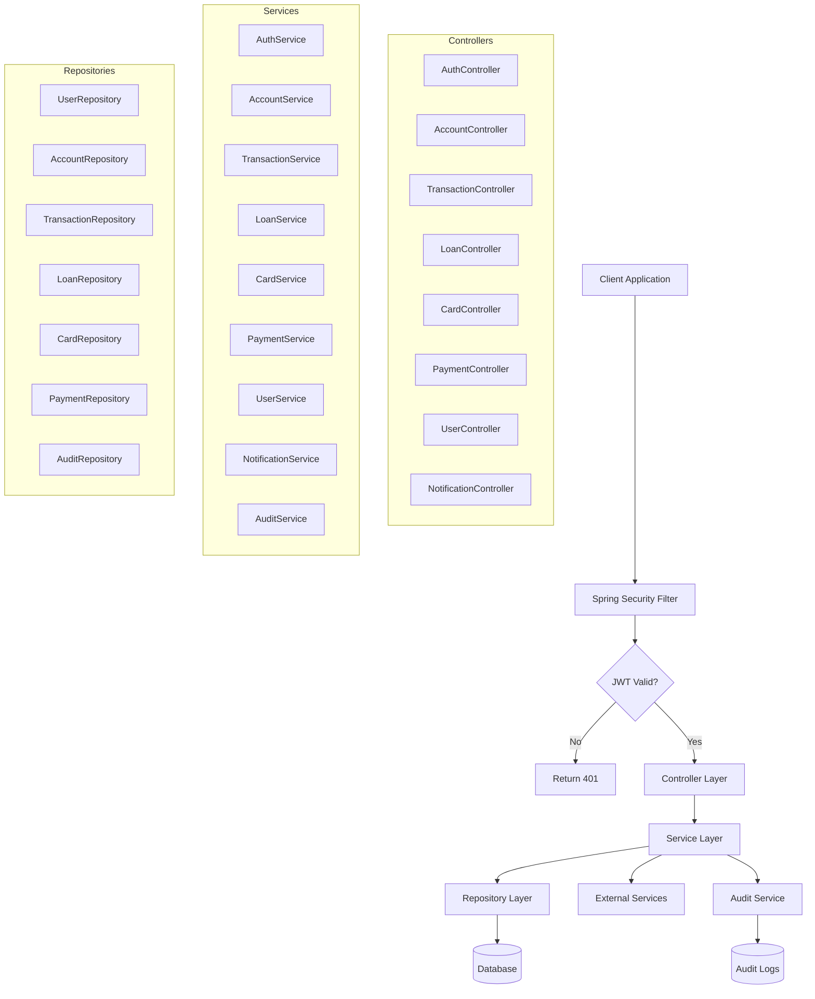
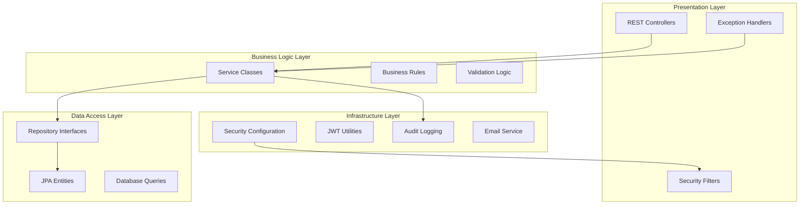
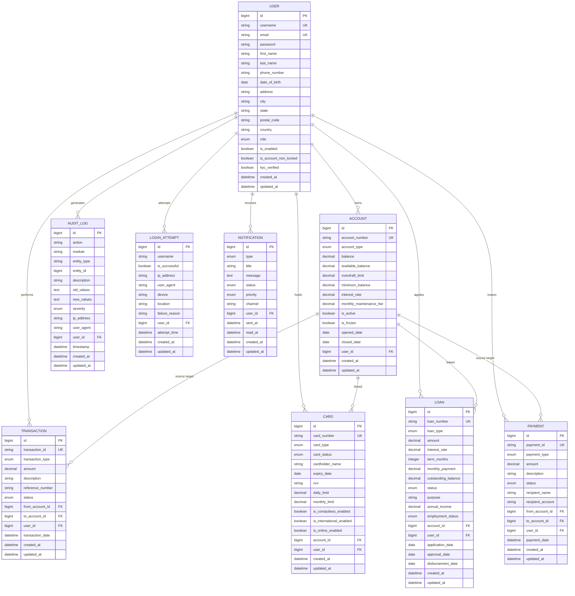
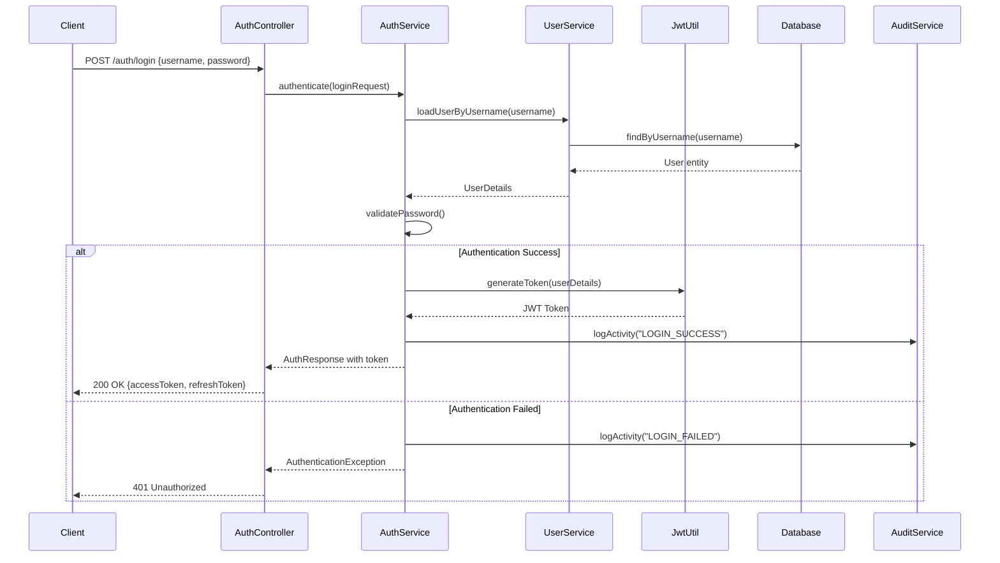
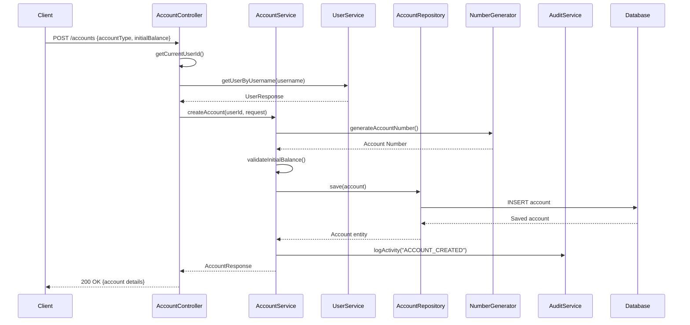
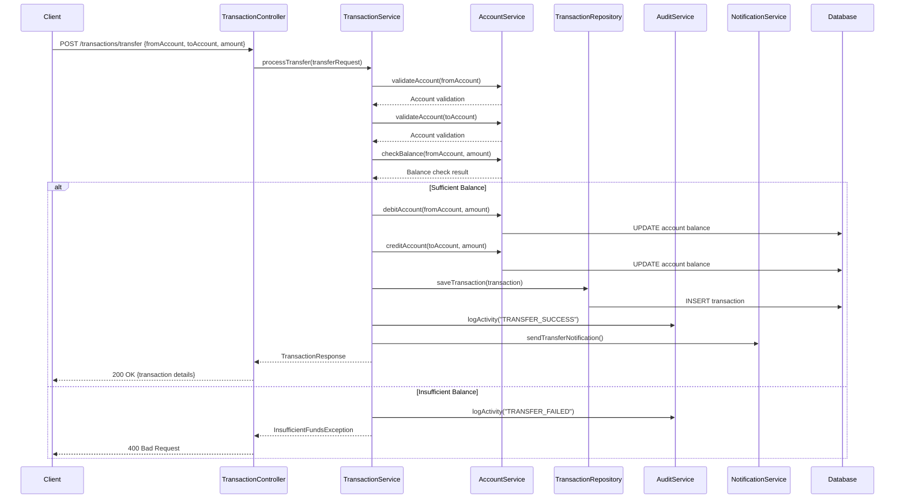
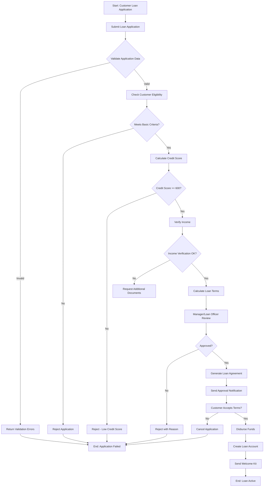
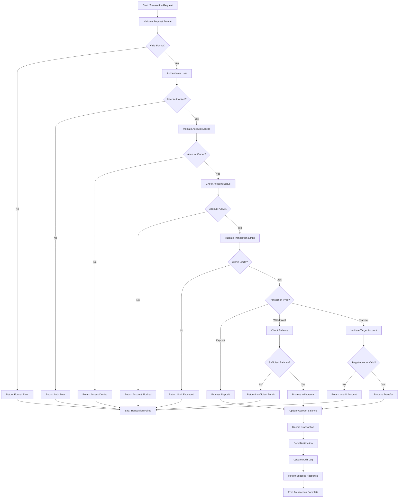
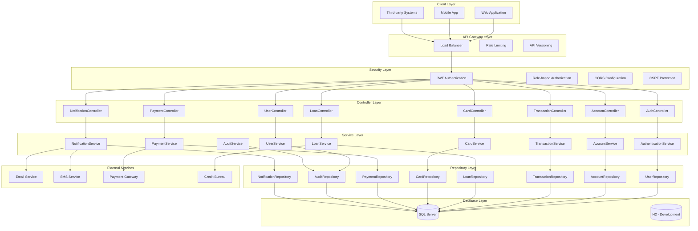

```mermaid
graph TB
    subgraph "Banking System Use Cases"
        subgraph "Customer Use Cases"
            UC1[Register Account]
            UC2[Login]
            UC3[View Account Balance]
            UC4[Create Bank Account]
            UC5[Deposit Money]
            UC6[Withdraw Money]
            UC7[Transfer Money]
            UC8[Apply for Loan]
            UC9[Request Card]
            UC10[Pay Bills]
            UC11[View Transactions]
            UC12[Update Profile]
        end
        
        subgraph "Teller Use Cases"
            UC13[Assist Customer Registration]
            UC14[Process Deposits/Withdrawals]
            UC15[Handle Account Issues]
            UC16[Reset Customer Password]
            UC17[Search Customer Records]
            UC18[Process Loan Applications]
            UC19[Issue/Block Cards]
            UC20[Unlock Customer Accounts]
        end
        
        subgraph "Admin Use Cases"
            UC21[Manage Users]
            UC22[View System Reports]
            UC23[Configure System Settings]
            UC24[Monitor Transactions]
            UC25[Approve High-Value Transactions]
            UC26[Generate Audit Reports]
            UC27[Manage User Roles]
        end
        
        subgraph "System Use Cases"
            UC28[Validate Transactions]
            UC29[Send Notifications]
            UC30[Log Activities]
            UC31[Calculate Interest]
            UC32[Generate Reports]
            UC33[Backup Data]
        end
    end
    
    %% Actors
    Customer --> UC1
    Customer --> UC2
    Customer --> UC3
    Customer --> UC4
    Customer --> UC5
    Customer --> UC6
    Customer --> UC7
    Customer --> UC8
    Customer --> UC9
    Customer --> UC10
    Customer --> UC11
    Customer --> UC12
    
    Teller --> UC13
    Teller --> UC14
    Teller --> UC15
    Teller --> UC16
    Teller --> UC17
    Teller --> UC18
    Teller --> UC19
    Teller --> UC20
    
    Admin --> UC21
    Admin --> UC22
    Admin --> UC23
    Admin --> UC24
    Admin --> UC25
    Admin --> UC26
    Admin --> UC27
    
    System --> UC28
    System --> UC29
    System --> UC30
    System --> UC31
    System --> UC32
    System --> UC33
```

# 🏦 Mlfts Bank API - Backend Documentation

## 📋 Table of Contents
1. [System Overview](#system-overview)
2. [Architecture Diagrams](#architecture-diagrams)
3. [Entity Relationship Diagram](#entity-relationship-diagram)
4. [Use Case Diagram](#use-case-diagram)
5. [Sequence Diagrams](#sequence-diagrams)
6. [Activity Diagrams](#activity-diagrams)
7. [System Architecture](#system-architecture)
8. [API Functions Documentation](#api-functions-documentation)
9. [Database Design](#database-design)
10. [Security Implementation](#security-implementation)
11. [Test Coverage Reports](#test-coverage-reports)
12. [Installation & Setup](#installation--setup)

---

## 🎯 System Overview

The Mlfts Bank API is a robust Spring Boot backend application that provides complete banking operations including account management, transaction processing, loan management, card services, and payment processing with role-based access control.

### Key Features
- **Multi-Role Authentication**: CUSTOMER, ADMIN, MANAGER, TELLER, LOAN_OFFICER, SECURITY_OFFICER
- **Account Management**: Checking, Savings, Business accounts
- **Transaction Processing**: Deposits, Withdrawals, Transfers
- **Loan Management**: Personal, Home, Auto, Business loans
- **Card Services**: Debit/Credit card management
- **Payment Processing**: Bill payments, Internal/External transfers
- **Security**: JWT authentication, Role-based access, Audit logging
- **Notification System**: Real-time alerts and notifications

### Technology Stack
- **Framework**: Spring Boot 3.2.0
- **Security**: Spring Security with JWT
- **Database**: SQL Server (Primary), H2 (Development)
- **ORM**: Hibernate/JPA
- **Documentation**: Swagger/OpenAPI 3
- **Build Tool**: Maven
- **Java Version**: 17+

---

## 🏗️ Architecture Diagrams

### System Architecture Flow Chart



### Layered Architecture



---

## 📊 Entity Relationship Diagram



---

## 👥 Use Case Diagram



---

## 🔄 Sequence Diagrams

### User Authentication Sequence



### Account Creation Sequence



### Money Transfer Sequence



---

## 📈 Activity Diagrams

### Loan Application Process



### Transaction Processing Flow



---

## 🔧 System Architecture

### Component Architecture



---

## 📚 API Functions Documentation

All API functions are documented in detail in the `api-functions` folder:

### Controller Functions
- [AuthController Functions](./api-functions/auth-controller-functions.md)
- [AccountController Functions](./api-functions/account-controller-functions.md)
- [TransactionController Functions](./api-functions/transaction-controller-functions.md)
- [LoanController Functions](./api-functions/loan-controller-functions.md)
- [CardController Functions](./api-functions/card-controller-functions.md)
- [PaymentController Functions](./api-functions/payment-controller-functions.md)
- [UserController Functions](./api-functions/user-controller-functions.md)
- [NotificationController Functions](./api-functions/notification-controller-functions.md)

### Service Functions
- [AuthenticationService Functions](./api-functions/authentication-service-functions.md)
- [AccountService Functions](./api-functions/account-service-functions.md)
- [TransactionService Functions](./api-functions/transaction-service-functions.md)
- [LoanService Functions](./api-functions/loan-service-functions.md)
- [CardService Functions](./api-functions/card-service-functions.md)
- [PaymentService Functions](./api-functions/payment-service-functions.md)
- [UserService Functions](./api-functions/user-service-functions.md)
- [NotificationService Functions](./api-functions/notification-service-functions.md)
- [AuditService Functions](./api-functions/audit-service-functions.md)

### Repository Functions
- [Repository Functions](./api-functions/repository-functions.md)

### Utility Functions
- [Security Utilities](./api-functions/security-utilities.md)
- [JWT Utilities](./api-functions/jwt-utilities.md)
- [Number Generator](./api-functions/number-generator.md)

---

## 🗄️ Database Design

### Primary Entities

| Entity | Purpose | Key Attributes |
|--------|---------|----------------|
| **User** | Store user account information | username, email, role, profile data |
| **Account** | Bank accounts for users | account_number, type, balance, limits |
| **Transaction** | Record all financial transactions | amount, type, status, accounts involved |
| **Card** | Debit/Credit cards | card_number, type, limits, security settings |
| **Loan** | Loan applications and accounts | amount, terms, interest_rate, status |
| **Payment** | Payment processing records | payment_type, amount, recipients |
| **AuditLog** | System activity logging | action, entity changes, user activity |
| **Notification** | User notifications | type, message, delivery status |

### Database Indexes

```sql
-- Performance indexes
CREATE INDEX idx_user_username ON users(username);
CREATE INDEX idx_user_email ON users(email);
CREATE INDEX idx_account_user_id ON accounts(user_id);
CREATE INDEX idx_account_number ON accounts(account_number);
CREATE INDEX idx_transaction_user_id ON transactions(user_id);
CREATE INDEX idx_transaction_date ON transactions(transaction_date);
CREATE INDEX idx_card_user_id ON cards(user_id);
CREATE INDEX idx_card_account_id ON cards(account_id);
CREATE INDEX idx_loan_user_id ON loans(user_id);
CREATE INDEX idx_audit_user_id ON audit_logs(user_id);
CREATE INDEX idx_audit_timestamp ON audit_logs(timestamp);
```

---

## 🔐 Security Implementation

### Authentication & Authorization

#### JWT Token Structure
```json
{
  "header": {
    "alg": "HS512",
    "typ": "JWT"
  },
  "payload": {
    "sub": "username",
    "roles": ["CUSTOMER"],
    "iat": 1234567890,
    "exp": 1234567890
  }
}
```

#### Role-Based Access Control

| Role | Permissions |
|------|-------------|
| **CUSTOMER** | Own account management, transactions, loans, cards |
| **TELLER** | Customer service, account assistance, basic operations |
| **ADMIN** | Full system access, user management, configuration |
| **MANAGER** | Oversight, reporting, approval workflows |
| **LOAN_OFFICER** | Loan processing, approval, management |
| **SECURITY_OFFICER** | Security monitoring, fraud detection |

#### Security Features
- **Password Encryption**: BCrypt hashing
- **Token Expiration**: Configurable JWT expiration
- **Rate Limiting**: Request throttling
- **Account Lockout**: Failed login protection
- **Audit Logging**: Complete activity tracking
- **Input Validation**: Request sanitization
- **CORS Configuration**: Cross-origin protection

---

## 🧪 Test Coverage Reports

### JaCoCo Test Coverage Integration

This project includes comprehensive test coverage reporting using **JaCoCo 0.8.13** with Java 17 compatibility.

#### Running Tests with Coverage

```bash
# Run all tests with coverage report
mvn clean test

# Run specific test class
mvn test -Dtest=AccountServiceTest

# Generate coverage report only
mvn jacoco:report
```

#### Coverage Report Locations

After running tests, coverage reports are generated in multiple formats:

- **HTML Report**: `target/site/jacoco/index.html` - Interactive web report
- **XML Report**: `target/site/jacoco/jacoco.xml` - CI/CD integration
- **CSV Report**: `target/site/jacoco/jacoco.csv` - Data analysis

#### Coverage Configuration

JaCoCo is configured with coverage thresholds and exclusions:

```xml
<plugin>
    <groupId>org.jacoco</groupId>
    <artifactId>jacoco-maven-plugin</artifactId>
    <version>0.8.13</version>
    <configuration>
        <excludes>
            <exclude>**/dto/**</exclude>
            <exclude>**/config/**</exclude>
            <exclude>**/Application.class</exclude>
        </excludes>
        <rules>
            <rule>
                <element>BUNDLE</element>
                <limits>
                    <limit>
                        <counter>INSTRUCTION</counter>
                        <value>COVEREDRATIO</value>
                        <minimum>0.50</minimum>
                    </limit>
                </limits>
            </rule>
        </rules>
    </configuration>
</plugin>
```

#### Current Coverage Status

- **Total Classes Analyzed**: 61
- **Test Classes**: 2 (BankingSystemApplicationTests, AccountServiceTest)
- **Test Methods**: 8 total test cases
- **AccountService Coverage**: ~60% instruction coverage, 66% line coverage

#### Coverage Highlights by Package

| Package | Coverage Focus | Status |
|---------|----------------|--------|
| **Controller Layer** | API endpoint testing | Planned |
| **Service Layer** | Business logic coverage | AccountService: ✅ 60% |
| **Repository Layer** | Data access testing | Planned |
| **Security Layer** | Authentication testing | Planned |
| **Utility Classes** | Helper function testing | Planned |

#### Viewing Coverage Reports

1. **Open HTML Report**: Navigate to `target/site/jacoco/index.html` in your browser
2. **Drill Down**: Click on packages, classes, and methods for detailed coverage
3. **Color Coding**: 
   - 🟢 Green: Well covered code
   - 🟡 Yellow: Partially covered code  
   - 🔴 Red: Uncovered code

#### Integration with Build Process

Coverage reports are automatically generated during:
- Maven `test` phase
- CI/CD pipeline execution
- Development builds
- Release verification

#### Test Coverage Best Practices

1. **Unit Tests**: Focus on individual service methods
2. **Integration Tests**: Test controller-service interactions  
3. **Boundary Testing**: Validate edge cases and error conditions
4. **Security Testing**: Verify authentication and authorization
5. **Performance Testing**: Ensure acceptable response times

---

## 🚀 Installation & Setup

### Prerequisites
- Java 17 or higher
- Maven 3.6+
- SQL Server 2019+ (or H2 for development)
- IDE (IntelliJ IDEA, Eclipse, VS Code)

### Setup Steps

1. **Clone Repository**
```bash
git clone <repository-url>
cd banking-system
```

2. **Database Configuration**
```properties
# SQL Server (Production)
spring.datasource.url=jdbc:sqlserver://localhost:1433;databaseName=BankingSystemDB;encrypt=true;trustServerCertificate=true
spring.datasource.username=sa
spring.datasource.password=your_password

# H2 (Development)
spring.datasource.url=jdbc:h2:mem:bankingdb
spring.h2.console.enabled=true
```

3. **Build Application**
```bash
mvn clean compile
```

4. **Run Application**
```bash
mvn spring-boot:run
```

5. **Access Application**
- API Base URL: `http://localhost:8080/api/v1`
- Swagger UI: `http://localhost:8080/api/v1/swagger-ui.html`
- H2 Console: `http://localhost:8080/api/v1/h2-console`

### Environment Configuration

#### Development
```properties
spring.profiles.active=dev
logging.level.com.bankingsystem=DEBUG
```

#### Production
```properties
spring.profiles.active=prod
logging.level.com.bankingsystem=INFO
```

---

## 📊 API Documentation

### Base URL
```
http://localhost:8080/api/v1
```

### Authentication Endpoints
- `POST /auth/register` - User registration
- `POST /auth/login` - User login
- `POST /auth/refresh` - Token refresh
- `POST /auth/logout` - User logout

### Account Management
- `GET /accounts` - Get user accounts
- `POST /accounts` - Create new account
- `GET /accounts/{id}` - Get account details
- `PUT /accounts/{id}/freeze` - Freeze account
- `PUT /accounts/{id}/unfreeze` - Unfreeze account

### Transaction Management
- `GET /transactions/user` - Get user transactions
- `POST /transactions/deposit` - Deposit money
- `POST /transactions/withdraw` - Withdraw money
- `POST /transactions/transfer` - Transfer money

### Complete API documentation is available in Swagger UI after starting the application.

---

## 🤝 Contributing

1. Fork the repository
2. Create a feature branch
3. Commit your changes
4. Push to the branch
5. Create a Pull Request

---

## 📄 License

This project is licensed under the MIT License - see the LICENSE file for details.

---

## API Documentation

### Detailed Function Documentation
Complete API function documentation is available in the `api-functions` folder:

- **[Authentication Functions](api-functions/auth-controller-functions.md)** - User registration, login, password management
- **[Account Functions](api-functions/account-controller-functions.md)** - Account management, balance checks, settings
- **[Transaction Functions](api-functions/transaction-controller-functions.md)** - Deposits, withdrawals, transfers, statements
- **[Loan Functions](api-functions/loan-controller-functions.md)** - Loan applications, approvals, payments, schedules
- **[Card Functions](api-functions/card-controller-functions.md)** - Card management, activation, blocking, transactions
- **[Payment Functions](api-functions/payment-controller-functions.md)** - Bill payments, payee management, recurring payments
- **[User Functions](api-functions/user-controller-functions.md)** - Profile management, password reset, user search
- **[Notification Functions](api-functions/notification-controller-functions.md)** - Notification delivery, preferences, analytics

Each documentation file includes:
- Function descriptions and business logic
- Request/response examples with parameters
- Security features and role requirements
- Error handling and response codes
- cURL usage examples for testing
- Performance considerations

### API Overview
- **Total Controllers**: 8
- **Total Functions**: 64 documented endpoints
- **Authentication**: JWT-based with role-based access control
- **Base URL**: `http://localhost:8080/api/v1`

---

## 📞 Support

For support and questions:
- Email: tvntving@gmail.com
- Documentation: [API Docs](http://localhost:8080/api/v1/swagger-ui.html)
- Function Docs: [API Functions](api-functions/README.md)
- Issues: GitHub Issues

---

*Last Updated: August 12, 2025*
